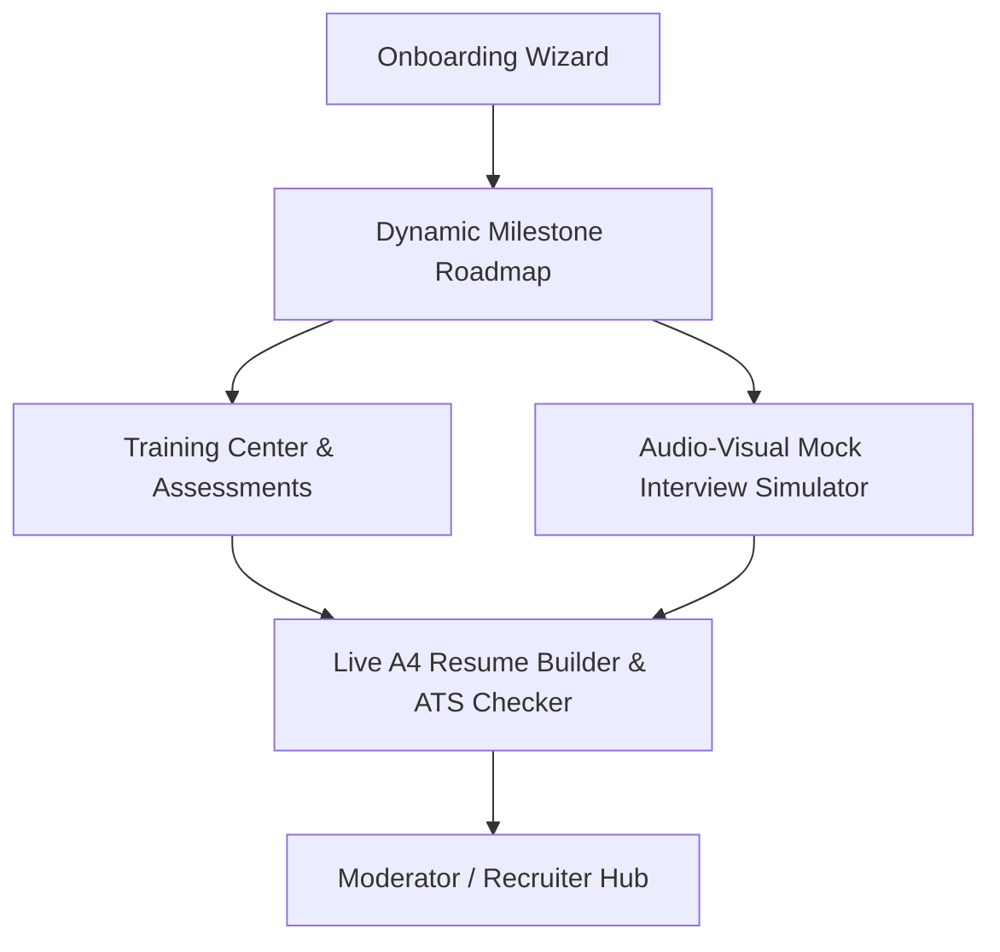

# SkillForgeAI: Complete Developer & Recompilation Documentation

Welcome to the comprehensive documentation of **SkillForgeAI**, an end-to-end, AI-driven career intelligence and portfolio compilation suite. This document outlines the technological stack, design systems, folder architecture, database tables, core components, and engineering patterns.

---

## 🚀 Project Architecture Overview

SkillForgeAI is a 3-Stage Career Lifecycle platform designed to bridge the gap between academic institutions, students, and target industry recruiting requirements:
1. **Initiation Stage**: Academic onboarding wizard, custom interest profiling, and dynamic learning roadmap milestone generators.
2. **Training & Posture Stage**: Dynamic technical assessments, logical aptitude quizzes, and an audio-visual mock interview simulator (utilizing talking AI synthesis and voice transcription speech APIs).
3. **Compilation & Recruitment Stage**: Live A4 PDF-standard Resume Editor with integrated real-time ATS compatibility checks, keyword matching, and AI Resume Coach chat assistants. This links to a Recruiting Moderator Hub matching qualified candidate profiles to corporate job filters.



---

## 🛠️ Technological Stack & Libraries

* **Core Runtime & Build Tool**: React (v18.3.1) and Vite (v5.3.1). vite handles fast hot module replacement and native ES Modules bundling.
* **Database & Cloud Services**: Supabase (PostgreSQL engine) for auth sessions, profiles data, assessments metrics, and resume templates.
* **Branding Typography**: Google Fonts integration inside CSS:
  - **Outfit**: Modern geometric typography for brand tags, headers, and the logo's premium sans-serif typography.
  - **Space Grotesk**: Space mono font for indicators and code layouts.
  - **Plus Jakarta Sans**: Calming sans-serif base font for main texts.
* **Icons Layouts**: `lucide-react` (v0.395.0) vector icon libraries.
* **Voice Capabilities**: Browser Web Speech API:
  - `window.speechSynthesis`: AI speech synthesizer reading question prompts.
  - `window.webkitSpeechRecognition`: Voice recognition transcribing answers.
* **Video Capture**: Browser Media Stream APIs (`navigator.mediaDevices.getUserMedia`) rendering active webcam video feeds.
* **Styling System**: Vanilla CSS supporting HSL design tokens, glassmorphism, responsive grid flex layouts, and custom cubic-bezier animations for Light Mode and Midnight Slate Dark Mode.

---

## 📂 Codebase File Map

The workspace is organized into a clean React Single-Page Application (SPA) structure:

```
d:/SkillForgeAI/
├── package.json                 # Node project parameters & build commands
├── vite.config.js               # Vite compilation configuration rules
├── index.html                   # HTML template & SEO meta definitions
├── supabase_schema.sql           # Database tables structure script
├── EXPLANATION_GUIDE.md         # Hackathon pitch summary guide
├── DOCUMENTATION.md             # This comprehensive engineering document
└── src/
    ├── main.jsx                 # React root DOM compiler entrypoint
    ├── index.css                # Global design system & theme transitions
    ├── App.jsx                  # State manager, navigation router, and logo container
    ├── services/
    │   ├── supabaseClient.js    # Supabase connection with live/offline fallback client
    │   └── aiService.js         # Offline presets & dynamic Google Gemini API connectors
    ├── hooks/
    │   └── useSpeech.js         # Wrapper hook for SpeechSynthesis & SpeechRecognition
    └── components/
        ├── GlassCard.jsx        # Glassmorphic card styling container
        ├── SettingsModal.jsx    # Supabase & Gemini API keys credentials panel
        ├── OnboardingWizard.jsx # Account setups and academic profile questionnaire
        ├── RoadmapView.jsx      # Stepper milestones roadmap with skill-learning popup modals
        ├── TrainingCenter.jsx   # Technical/Aptitude quizing with SVG progress history trendlines
        ├── InterviewSim.jsx     # Live audio-video mock interviewer & expert mentor billing simulation
        ├── ResumeBuilder.jsx    # Live A4 resume compiler, ATS Score scanner, and AI Resume Coach chat
        └── ModeratorPortal.jsx   # Recruiter student metrics overview dashboard
```

---

## 🗄️ Database Tables Schema & SQL Definitions

The database utilizes PostgreSQL tables mapped via Supabase Client schemas. If a live database connection is not configured, the app runs on a **Mock Service Layer** stored in `localStorage`.

```sql
-- 1. PROFILES TABLE: Student profile records
CREATE TABLE public.profiles (
    id UUID REFERENCES auth.users ON DELETE CASCADE PRIMARY KEY,
    name TEXT NOT NULL,
    college TEXT,
    branch TEXT,
    level TEXT,
    subjects TEXT[],
    interests TEXT[],
    timeline TEXT,
    created_at TIMESTAMP WITH TIME ZONE DEFAULT timezone('utc'::text, now()) NOT NULL
);

-- 2. SCORES TABLE: Quiz metrics and interview feedback transcripts
CREATE TABLE public.scores (
    id BIGSERIAL PRIMARY KEY,
    user_id UUID REFERENCES auth.users ON DELETE CASCADE,
    test_type TEXT NOT NULL, -- 'tech_training', 'aptitude', 'personality', 'mock_interview'
    score INTEGER NOT NULL,
    details JSONB DEFAULT '{}'::jsonb,
    created_at TIMESTAMP WITH TIME ZONE DEFAULT timezone('utc'::text, now()) NOT NULL
);

-- 3. RESUMES TABLE: Holds A4 Resume content values
CREATE TABLE public.resumes (
    id UUID REFERENCES auth.users ON DELETE CASCADE PRIMARY KEY,
    summary TEXT,
    skills TEXT[],
    experience JSONB DEFAULT '[]'::jsonb,
    projects JSONB DEFAULT '[]'::jsonb,
    education JSONB DEFAULT '[]'::jsonb,
    updated_at TIMESTAMP WITH TIME ZONE DEFAULT timezone('utc'::text, now()) NOT NULL
);

-- AUTOMATIC PROFILE INITIATION TRIGGER: Triggers on new auth signup
CREATE OR REPLACE FUNCTION public.handle_new_user()
RETURNS TRIGGER AS $$
BEGIN
    INSERT INTO public.profiles (id, name, college, branch, level, subjects, interests, timeline)
    VALUES (
        new.id,
        COALESCE(new.raw_user_meta_data->>'name', split_part(new.email, '@', 1)),
        'Partner Technical College',
        'CSE',
        'Undergrad',
        ARRAY['DSA', 'Web Technologies'],
        ARRAY['Full Stack'],
        '6 months'
    );
    
    INSERT INTO public.resumes (id, summary, skills, experience, projects, education)
    VALUES (
        new.id,
        'Motivated engineering student specializing in software development architectures.',
        ARRAY['JavaScript', 'HTML5', 'CSS3', 'React', 'Git'],
        '[]'::jsonb,
        '[]'::jsonb,
        '[]'::jsonb
    );
    RETURN new;
END;
$$ LANGUAGE plpgsql SECURITY DEFINER;

CREATE TRIGGER on_auth_user_created
    AFTER INSERT ON auth.users
    FOR EACH ROW EXECUTE FUNCTION public.handle_new_user();
```

---

## 🔬 Component Walkthrough & Programmatic Logic

### 1. Global Controller (`src/App.jsx`)
* **State Management**: Tracks active session tokens, user profiles, theme toggles, and navigation tab selections ('roadmap', 'training', 'interview', 'resume', 'moderator').
* **Theme Synchronization**: Listens to theme selection changes (Light Mode vs Dark Mode), updates `document.documentElement.setAttribute('data-theme', theme)`, and caches choices inside `localStorage` under `SF_THEME`.
* **Inline SVG Branding Logo**: Draws a customized minimalist SVG icon depicting a stylized hammer striking an AI silicon chip, using strict dark navy (#0b192c) and teal (#14b8a6) brand colors, styled inside a theme-adaptive badge container with smooth bezier hover transitions.

### 2. Onboarding Wizard (`src/components/OnboardingWizard.jsx`)
* Form state machine splitting signup forms into three cards:
  - Card 1: Auth data inputs (Email, Password, Name, College).
  - Card 2: Technical/Professional interest checkbox chips (e.g. AI/ML, Full Stack, Coding, Backend).
  - Card 3: Timeline settings. Triggers Supabase signup on completion.

### 3. Interactive Stepper Roadmap (`src/components/RoadmapView.jsx`)
* Displays milestones generated from Google Gemini prompts or offline mappings.
* **Interactive Skill Badges**: Maps required skills against `SKILL_TO_COURSES_MAP` or fallbacks on search query encoding targets for YouTube/Coursera. Clicking a badge displays the `Learning Path` popup modal containing curated courses, durations, price flags, and external redirected hyperlinks.
* Notice panels explain the clickable learning mechanism.

### 4. Technical Training Engine (`src/components/TrainingCenter.jsx`)
* Generates quizzes matching interests (Tech, Aptitude, or Multiple-Choice Workplace Personality situations).
* **Lightweight SVG Data Visualization**: Utilizes mathematical vectors to map past assessment metrics directly into SVG viewport dimensions (`<line>`, `<circle>`, `<path>`, `<text>`) showing learning trends.
* Dynamic card selectors display recommended study paths for scores under 90%.

### 5. Mock Interview Simulator (`src/components/InterviewSim.jsx`)
* **Progress Stepper Bar**: Displays current phase: Technical Phase (Q1-3), Behavioral STAR Phase (Q4-5), and Mindset/Personality Case-Study Phase (Q6-8).
* **Standby Video Card**: Activates `getUserMedia` streams; falls back to animated standby profiles when denied.
* **Interviewer Ring**: Animates spinning glowing borders around the avatar during speech synthesis (`spinRing` keyframes in `index.css`).
* **Circular SVG score dial & subscores**: Visualizes final evaluation transcripts into distinct scores: **Technical Depth**, **Communication**, and **Growth Mindset & Ethics**.
* **Simulated Billing checkout**: Embeds schedules and real-time virtual credit-card data bindings inside booking gates.

### 6. CV Designer & AI resume Coach (`src/components/ResumeBuilder.jsx`)
* Tabbed control workspace (Editor sections vs AI Coaching analysis).
* **CV Score Dial**: Measures formatting warnings, keyword densities, action verbs, and contact completeness.
* **Resume Coach chat**: Live chat bubble terminal connected to Gemini. Injects the active resume schema fields as structural context.
* **A4 Print Setup**: Formats layout rules to scale elements correctly for standard A4 paper size when triggering browser print dialogs (`window.print()`).

### 7. AI Service Router (`src/services/aiService.js`)
* Manages offline datasets and makes HTTP fetch calls to Google Gemini (`gemini-2.5-flash`) endpoints.
* Converts custom text templates into standard JSON formats using the API's `responseMimeType: "application/json"` specification.

### 8. Voice Hooks Controller (`src/hooks/useSpeech.js`)
* Configures SpeechSynthesisUtterance parameters (pitch, volume, US/UK voices).
* Instantiates `webkitSpeechRecognition` listeners to handle auto-transcription loops.

---

## ⚙️ Advanced Engineering Design Patterns

### 1. Seamless Theme transitions
To ensure the transition from Light Mode to Dark Mode looks smooth and does not cause elements to pop aggressively, global transitions are applied in [index.css](file:///d:/Skillforge/SkillForgeAI/src/index.css):
```css
body, header, .header, .glass-panel, .glass-card, .btn, .nav-item, .form-input, .form-textarea, .form-select, .form-label, svg, text, span, p, h1, h2, h3, h4, h5, h6, input, textarea, select {
  transition: background 0.3s cubic-bezier(0.4, 0, 0.2, 1),
              background-color 0.3s cubic-bezier(0.4, 0, 0.2, 1),
              color 0.3s cubic-bezier(0.4, 0, 0.2, 1),
              border-color 0.3s cubic-bezier(0.4, 0, 0.2, 1),
              box-shadow 0.3s cubic-bezier(0.4, 0, 0.2, 1),
              transform 0.3s cubic-bezier(0.4, 0, 0.2, 1);
}
```

### 2. Dual-Mode Client Fallback (Zero-Config Hackathon Readiness)
`supabaseClient.js` checks environment conditions on startup. If config keys are missing, it initializes a mock layer using local storage structures. Once a user inputs credentials in the Settings modal, it re-initializes and syncs data to live Supabase servers:
```javascript
const getSupabaseConfig = () => {
  const url = localStorage.getItem('SF_SUPABASE_URL') || '';
  const key = localStorage.getItem('SF_SUPABASE_KEY') || '';
  return { url, key };
};
```

---

## 🚀 Recompilation, Local Deployment & Testing

To compile, test, and host the application locally:

### 1. Package Installation & Local Run
Ensure you have **Node.js** (v18+) installed:
```bash
# Navigate into directory
cd d:/Skillforge/SkillForgeAI

# Install package dependencies
npm install

# Start Vite local development server
npm run dev
```
Open `http://localhost:5173` inside your browser.

### 2. Production Bundling Compilation
To compile the workspace files into optimized, static production chunks (`dist/assets/`):
```bash
npm run build
```
The output compiles cleanly into static HTML/CSS/JS without warning errors.

---

## 🎤 Playbook: How to Present this Project to Hackathon Judges

1. **The Core Hook**:
   * *"PDF resumes are static and unverified. SkillForgeAI bridges classrooms and boardrooms through a 3-stage ecosystem: initiation onboarding, technical/mindset testing with voice mock simulators, and certified A4 resume building with recruiter portal syncing."*
2. **Dynamic roadmap onboarding**:
   * Create an account. Expand milestone folders, and click on any required skill tag (e.g. "React Hooks") to reveal the popup modal displaying Coursera/freeCodeCamp course recommendations.
3. **Voice AI Mock Simulator**:
   * Enter the mock room, start the session, and answer questions. Highlight how speech recognition transcribes answers and the circular radial score dial tracks your progress against Technical, Communication, and Mindset vectors.
4. **Interactive Checkout & Mentor Billing**:
   * Open the Mentor modal, review expert backgrounds, select a time slot, and enter credentials in the credit-card checkout simulator.
5. **ATS Coach & Printer Editor**:
   * Fill details, check keywords, and converse with the AI Resume Coach. Print the resume to show standard PDF print alignments.
